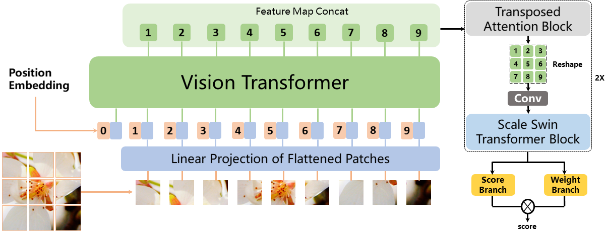
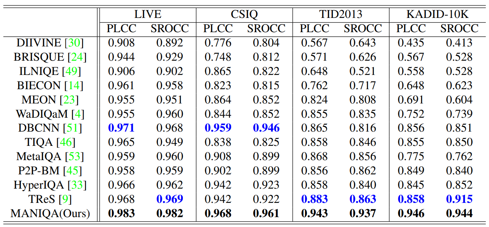

# MANIQA: Multi-dimension Attention Network for No-Reference Image Quality Assessment
This is the official repository for NTIRE2022 Perceptual Image Quality Assessment Challenge Track 2 No-Reference competition.
***We won first place in the competition and the codes have been released now.***

> **Abstract:** *No-Reference Image Quality Assessment (NR-IQA) aims to assess the perceptual quality of images in accordance with human subjective perception. 
Meanwhile, generative adversarial networks (GAN) play an important role in restoring and enhancing images than traditional CNN-generated images.
Unfortunately, the existing NR-IQA methods are far from meeting the needs of predicting accurate quality scores on GAN-based distortion images. 
To this end, we propose the Multi-dimension Attention Network for no-reference Image Quality Assessment (MANIQA), which can improve the performance of an IQA network on GAN-based distortion. We further propose the Transposed Attention Block (TAB) for channel dimension interaction rather than spatial dimension, which implicitly fuses the global features. To strengthen the local interaction among different regions of an image, we propose Scale Swin Transformer Block (SSTB). 
These two modules apply attention mechanisms across the channel and spatial dimension. In this multi-dimensional manner, the modules cooperatively increase the interaction among different regions of images globally and locally.Besides, a Dual branch structure for patch-weighted quality prediction is applied to predict the final score depending on the weight of each patch's score. The experiment results on the NTIRE 2022 Perceptual Image Quality Assessment Challenge dataset show the outstanding performance of MANIQA, and our ensemble approach wons first place in the final testing phase of the challenge. Furthermore, our method also outperforms state-of-the-arts (SoTA) in the other four datasets (LIVE, TID2013, CSIQ, and KADID-10K) by a large margin.* 

## Network Architecture


## Dataset
The training set is [PIPAL22](https://codalab.lisn.upsaclay.fr/competitions/1568#participate-get_data) and the validation dataset is [PIPAL21](https://competitions.codalab.org/competitions/28050#participate). We have conducted experiments on [LIVE](https://live.ece.utexas.edu/research/Quality/subjective.htm), [CSIQ](https://qualinet.github.io/databases/image/categorical_image_quality_csiq_database/), [TID2013](https://qualinet.github.io/databases/image/tampere_image_database_tid2013/) and [KADID-10K](http://database.mmsp-kn.de/kadid-10k-database.html) datasets. 

**NOTE:**
+ Put the MOS label and the data python files into **data** folder. 
+ The validation dataset comes from NTIRE 2021. If you want to reproduce the results on validation or test set for NTIRE 2022 NR-IQA competition, register the competition and upload the submission.zip by following the instruction on the [website](https://codalab.lisn.upsaclay.fr/competitions/1568#participate).

## Training
```
# Training MANIQA model, run:
python train_maniqa.py
```
## Inference for [PIPAL22](https://codalab.lisn.upsaclay.fr/competitions/1568#participate-get_data) Validing and Testing
```
# Generating the ouput file, run:
python inference.py
```
## Environments
- Platform: PyTorch 1.8.0
- Language: Python 3.7.9
- Ubuntu 18.04.6 LTS (GNU/Linux 5.4.0-104-generic x86\_64)
- CUDA Version 11.2
- GPU: NVIDIA GeForce RTX 3090 with 24GB memory

## Requirements
 Python requirements can installed by:
```
pip install -r requirements.txt
```

## Acknowledgment
Our codes partially borrowed from [anse3832](https://github.com/anse3832/MUSIQ) and [timm](https://github.com/rwightman/pytorch-image-models).

## Related Work
### Full-Reference
1. [CVPR 2021] [Region-Adaptive Deformable Network for Image Quality Assessment](https://arxiv.org/abs/2104.11599)
