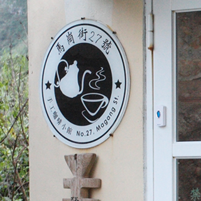
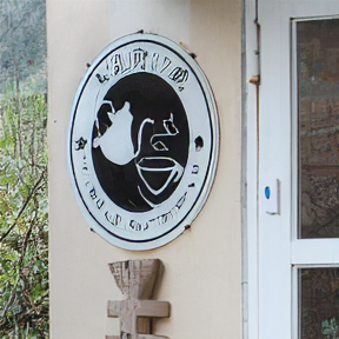
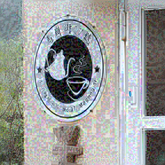
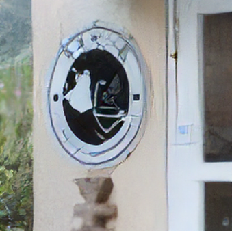
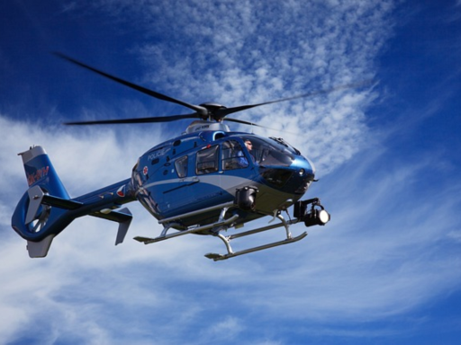
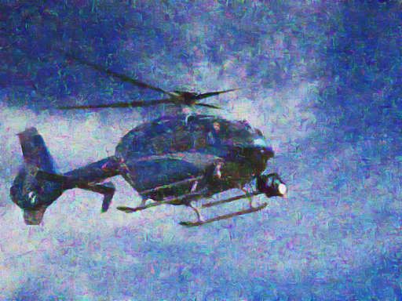
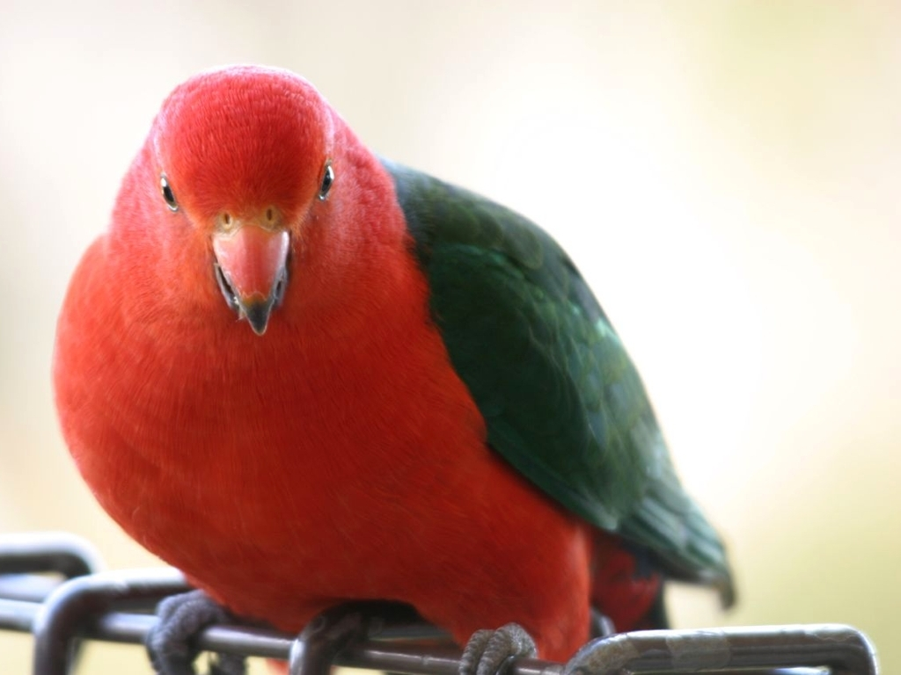
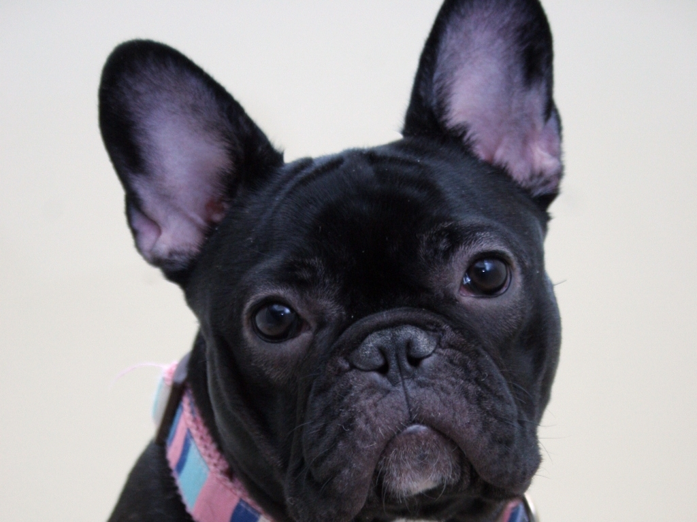
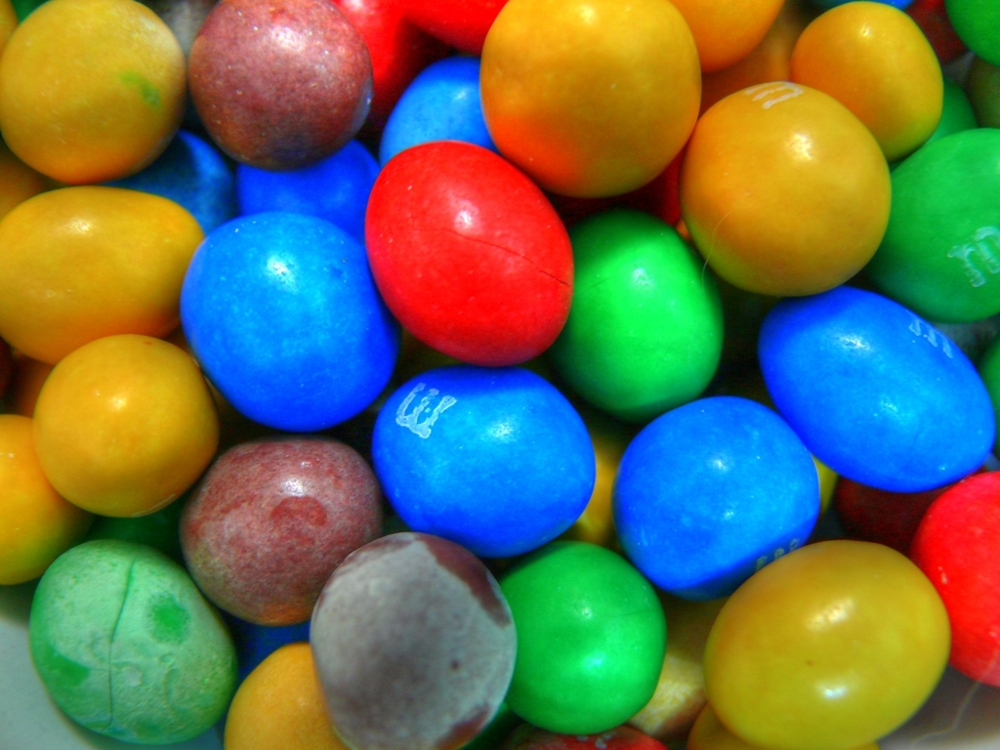
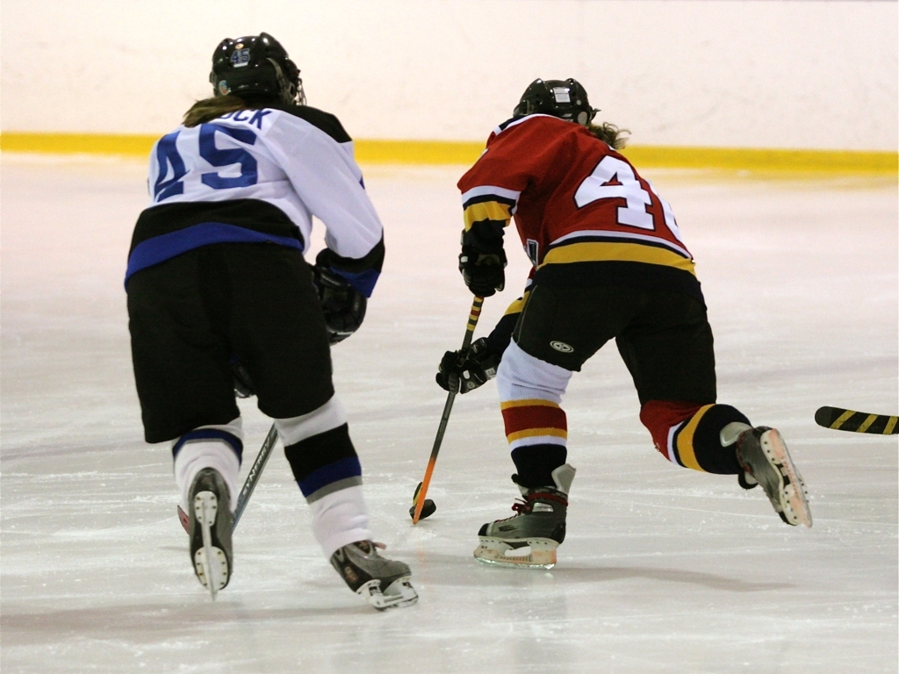

# MANIQA: Multi-dimension Attention Network for No-Reference Image Quality Assessment

Sidi Yang*, Tianhe Wu*, Shuwei Shi, Shanshan Lao, Yuan Gong, Mingdeng Cao, Jiahao Wang and Yujiu Yang

[Tsinghua University Intelligent Interaction Group](https://sites.google.com/view/iigroup-thu/home)

:rocket:  :rocket:  :rocket: **Updates:**
- something more...
- ✅ **Mar. 11, 2023**: Model trained with Koniq10k dataset checkpoint has be released.
- ✅ **Mar. 10, 2023**: We release the large dataset (kadid10k) checkpoint and add the **predicting one image files**.
- ✅ **April. 11, 2022**: We release the MANIQA source code and the checkpoint of PIPAL22.

[](https://arxiv.org/abs/2204.08958)
[](https://github.com/IIGROUP/MANIQA/releases)
[](https://github.com/IIGROUP/MANIQA/issues)
[](https://github.com/IIGROUP/MANIQA/issues)

[](https://github.com/IIGROUP)
[](https://github.com/IIGROUP/MANIQA)


This repository is the official PyTorch implementation of MANIQA: Multi-dimension Attention Network for No-Reference Image Quality Assessment. :fire::fire::fire: We won first place in the **NTIRE2022 Perceptual Image Quality Assessment Challenge Track 2 No-Reference competition**.


|Ground Truth|Distortion 1|Distortion 2|Distortion 3|Distortion 4|
|       :---:       |     :---:        |        :-----:         |        :-----:         |        :-----:         | 
| |||||
|**MOS (GT)**|**1539.1452 (1)**|**1371.4593 (2)**|**1223.4258 (3)**|**1179.6223 (4)**|
|**Ours (MANIQA)**|**0.743674 (1)**|**0.625845 (2)**|**0.504243 (3)**|**0.423222 (4)**|
| |||||
|**MOS (GT)**|**4.33 (1)**|**2.27 (2)**|**1.33 (3)**|**1.1 (4)**|
|**Ours (MANIQA)**|**0.8141 (1)**|**0.2615 (2)**|**0.0871 (3)**|**0.0490 (4)**|
| |||||
|**Model: 0.3398**|**Model: 0.2612**|**Model: 0.3078**|**Model: 0.3716**|**Model: 0.3581**|


---

> *No-Reference Image Quality Assessment (NR-IQA) aims to assess the perceptual quality of images in accordance with human subjective perception. Unfortunately, existing NR-IQA methods are far from meeting the needs of predicting accurate quality scores on GAN-based distortion images. To this end, we propose Multi-dimension Attention Network for no-reference Image Quality Assessment (MANIQA) to improve the performance on GAN-based distortion. We firstly extract features via ViT, then to strengthen global and local interactions, we propose the Transposed Attention Block (TAB) and the Scale Swin Transformer Block (SSTB). These two modules apply attention mechanisms across the channel and spatial dimension, respectively. In this multi-dimensional manner, the modules cooperatively increase the interaction among different regions of images globally and locally. Finally, a dual branch structure for patch-weighted quality prediction is applied to predict the final score depending on the weight of each patch's score. Experimental results demonstrate that MANIQA outperforms state-of-the-art methods on four standard datasets (LIVE, TID2013, CSIQ, and KADID-10K) by a large margin. Besides, our method ranked first place in the final testing phase of the NTIRE 2022 Perceptual Image Quality Assessment Challenge Track 2: No-Reference.* 
---

## Network Architecture


## Dataset
The [PIPAL22](https://codalab.lisn.upsaclay.fr/competitions/1568#participate-get_data) dataset is used in NTIRE22 competition and we test our model in [PIPAL21](https://competitions.codalab.org/competitions/28050#participate).  
We also conducted experiments on [LIVE](https://live.ece.utexas.edu/research/Quality/subjective.htm), [CSIQ](https://qualinet.github.io/databases/image/categorical_image_quality_csiq_database/), [TID2013](https://qualinet.github.io/databases/image/tampere_image_database_tid2013/) and [KADID-10K](http://database.mmsp-kn.de/kadid-10k-database.html) datasets. 

**Attention:**
- Put the MOS label and the data python files into **data** folder. 
- The validation dataset comes from NTIRE 2021. If you want to reproduce the results on validation or test set for NTIRE 2022 NR-IQA competition, register the competition and upload the submission.zip by following the instruction on the [website](https://codalab.lisn.upsaclay.fr/competitions/1568#participate).

## Checkpoints

Click into the website and download the pretrained model checkpoints, ignoring the source files (tag Koniq-10k has the latest source file).
| Training Set | Testing Set|        Checkpoints of MANIQA     | 
| :---:        |     :---:      |:---:      |
|[PIPAL2022](https://codalab.lisn.upsaclay.fr/competitions/1568#participate-get_data) dataset (200 reference images, 23200 distortion images, MOS scores for each distortion image) | [Validation] [PIPAL2022](https://codalab.lisn.upsaclay.fr/competitions/1568#participate-get_data) dataset (1650 distortion images) |[download](https://github.com/IIGROUP/MANIQA/releases/tag/PIPAL22-VALID-CKPT) <br /> SRCC:0.686, PLCC:0.707|
| [KADID-10K](http://database.mmsp-kn.de/kadid-10k-database.html) dataset (81 reference images and 10125 distorted images). 8000 distorted images for training | [KADID-10K](http://database.mmsp-kn.de/kadid-10k-database.html) dataset. 2125 distorted images for testing |[download](https://github.com/IIGROUP/MANIQA/releases/tag/Kadid10k)<br />SRCC:0.939, PLCC:0.939|
| [KONIQ-10K](http://database.mmsp-kn.de/koniq-10k-database.html) dataset (in-the-wild database, consisting of 10,073 quality scored images). 8058 distorted images for training | [KONIQ-10K](http://database.mmsp-kn.de/koniq-10k-database.html) dataset. 2015 distorted images for testing |[download](https://github.com/IIGROUP/MANIQA/releases/tag/Koniq10k)<br />SRCC:0.930, PLCC:0.946|


## Usage
### Training MANIQA model
- Modify "dataset_name" in config
- Modify train dataset path: "train_dis_path"
- Modify validation dataset path: "val_dis_path"
```
python train_maniqa.py
```
### Predicting one image quality score
- Modify the path of image "image_path"
- Modify the path of checkpoint "ckpt_path"
```
python predict_one_image.py 
```
### Inference for [PIPAL22](https://codalab.lisn.upsaclay.fr/competitions/1568#participate-get_data) validing and testing
Generating the ouput file:
- Modify the path of dataset "test_dis_path"
- Modify the trained model path "model_path"
```
python inference.py
```


## Results


## Environments
- Platform: PyTorch 1.8.0
- Language: Python 3.7.9
- Ubuntu 18.04.6 LTS (GNU/Linux 5.4.0-104-generic x86\_64)
- CUDA Version 11.2
- GPU: NVIDIA GeForce RTX 3090 with 24GB memory

## Requirements
 Python requirements can installed by:
```
pip install -r requirements.txt
```

## Citation
```
@inproceedings{yang2022maniqa,
  title={MANIQA: Multi-dimension Attention Network for No-Reference Image Quality Assessment},
  author={Yang, Sidi and Wu, Tianhe and Shi, Shuwei and Lao, Shanshan and Gong, Yuan and Cao, Mingdeng and Wang, Jiahao and Yang, Yujiu},
  booktitle={Proceedings of the IEEE/CVF Conference on Computer Vision and Pattern Recognition},
  pages={1191--1200},
  year={2022}
}
```

## Acknowledgment
Our codes partially borrowed from [anse3832](https://github.com/anse3832/MUSIQ) and [timm](https://github.com/rwightman/pytorch-image-models). Thanks for the [SwinIR](https://github.com/JingyunLiang/SwinIR) Readme.md. We modify ours file like them.

## Related Work
### NTIRE2021 IQA Full-Reference Competition
[CVPRW 2021] Region-Adaptive Deformable Network for Image Quality Assessment (4th place in FR track)

[](https://arxiv.org/abs/2104.11599)
[](https://github.com/IIGROUP/RADN)

### NTIRE2022 IQA Full-Reference Competition
[CVPRW 2022] Attentions Help CNNs See Better: Attention-based Hybrid Image Quality Assessment Network. (1th place in FR track)

[](https://arxiv.org/abs/2204.10485)
[](https://github.com/IIGROUP/AHIQ)
